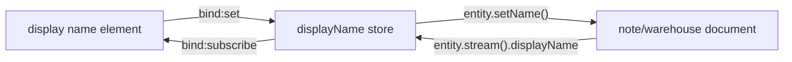
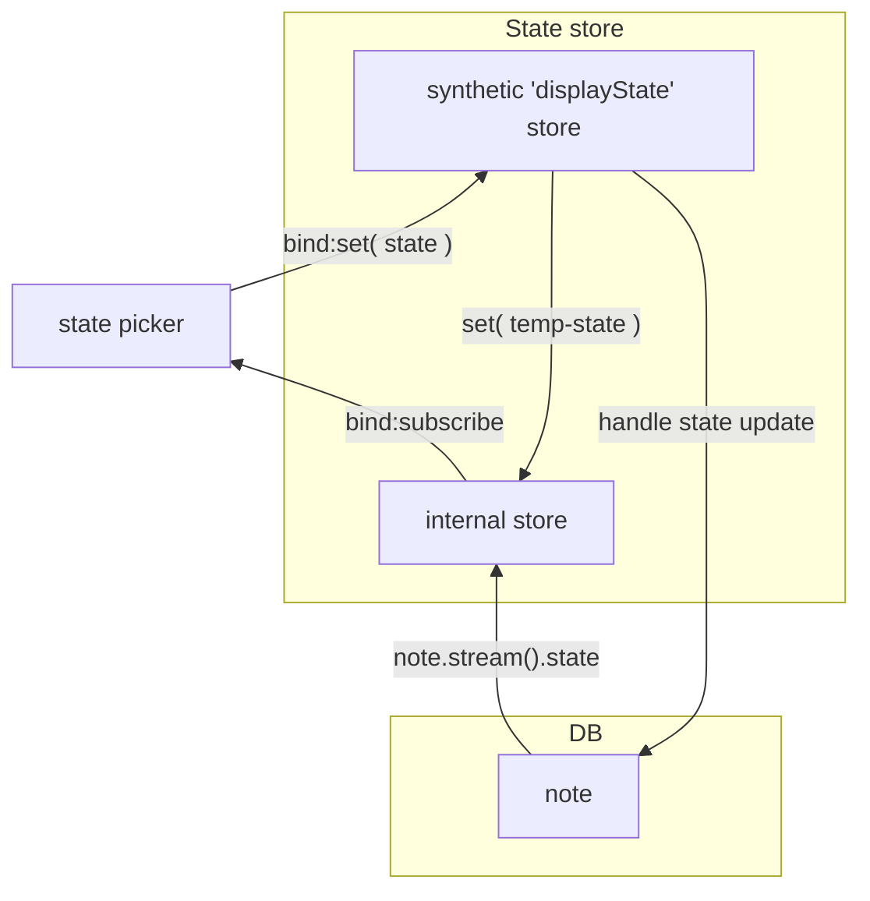
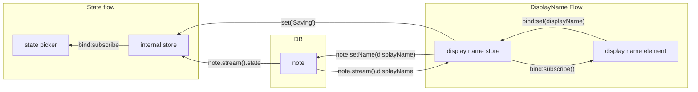
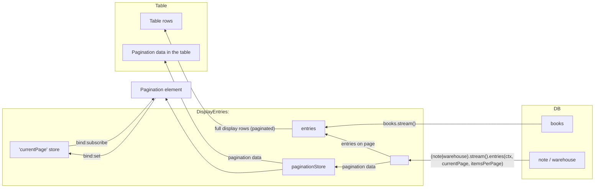

# @libroco/web-client

This is our main app, using modules from `db`, `js-search` and `shared` packages (with `book-data-extension` plugin), putting them together and creating a user facing dashboard, used to manipluate and view the book store inventory.

## TOC

1. [Structure](#1-structure):
   - [1.1. Inventory](#11-inventory):
     - [1.1.1. Views](#111-views)
     - [1.1.2. Data flows](#112-data-flows)
2. [Development](#2-development)

## 1. Structure

This app is bootstrapped using `svelte-kit` (`svelte` being our UI framework of choice).

We're using svelte kit adapter `static`: at build time, only the core html skeleton is prerendered, while the functionality is initialised only when the app is opened in the browser.

We're using PouchDB (on top of browser's IndexedDB), as a local db instance and replicating to the remote db. For this to be initialised, we need to be in the browser, hence our prerendering logic described above.

**Loading the app:**

When the app is opened, the top level load function checks if in browser environment and performs [db.init](../../pkg/db/README.md#212-initialising-the-interface). `db.init` replicates the data from the remote db:

- this might take awhile the first time the app is opened (as the entire remote db needs to be replicated into the local one)
- each subsequent run will merely pull the changes (to get the local db up to speed)

After the local db is created, and populated with the contents from the remote db, the bidirectional sync is started.

At this point the top level load function resolves and the rest of the load functions load their data and populate the UI.

### 1.1. Inventory

The main (and currently the only) top level view is the inventory. It is the main dashboard, used to inspect and update the book inventory.

[See database docs for more info on the way the inventory is organised](../../pkg/db/README.md#2-usage)

#### 1.1.1. Views

- `/stock`:

  - **default view**
  - this is the view of the entire stock with full text search functionality
  - due to the number of entries in stock, nothing is rendered until some (search) filter is applied
  - with some search filer string, the results are shown
  - when there's too many results to show, the dynamic loading is performed using the intersection observer

- `/inventory`:

  - the inventory view shows warehouses and notes (as a way to organise inventory)
  - it features two sub-views:
    - warehouses
    - inbound

- `/inventory/warehouses`:

  - displays a list of warehouses (and quick edit operations: warehouse name, discount)

- `/inventory/warehouses/[...warehouseId]`:

  - inspect stock for a particular warehouse

- `/inventory/inbound`:

  - displays a list of inbound notes

- `/inventory/inbound/[...noteId]`:

  - inspect / edit note (stock, meta data, etc.)

- `/outbound`:

  - displays a list of inbound notes

- `/outbound/[...noteId]`:

  - inspect / edit note (stock, meta data, etc.)

- `/settings`

  - edit settings (currently only the sync options)

#### 1.1.2. Data flows

The data is retrieved from the db, primarily through the db streams (with respect to the view).

The data streams are transformed in `lib/stores`, combining/transforming the data, and made available to the UI as svelte stores.

##### Binding the element value to svelte store

To display/update the data streamed, we simply bind the stores to interactive elements, allowing for bidirectional updates.

The way this works, under the hood, is:

- Svelte performs `store.subscribe` to pass the value to the element, in diagrams we'll call this `bind:subscribe`
- each time the element gets updated (sort of `on:change`), Svelte performs `store.set` with the updated value, in diagrams, we'll call this `bind:set`
- when the element is destroyed, the store gets unsubscribed from

##### 'displayName' store

The `displayName` store streams the display name from the db entry (note/warehouse) and provides a `set` method used to update the same displayName (in the db):



To create a display name store, we use the factory function:

```typescript
const warehouse = db.warehouse("warehouse-1");
const note = wareshouse.note("note-1");

const wDisplayName = createDisplayNameStore({}, warehouse, null);
const nDisplayName = createDisplayNameStore({}, note, null);
```

The second param (`null` in the example) is used to pass in the internal state store, more on that below.

##### 'state' store

The state store connects the note state displayed in the UI with the one in the db.

Since the current implementation doesn't save the note state the same way it's displayed in the UI, we have to transform the value going back and forth.

Note states displayed by the UI are as follows: `Draft`, `Committed`, `Deleted`, whereas the state in the note document, in the db, is controlled by the `committed: true | false` property.

| UI        | note (in db)                                              |
| --------- | --------------------------------------------------------- |
| Draft     | committed: `false \| undefined`                           |
| Committed | committed: `true`                                         |
| Deleted   | doesn't exist in the db (in the future this might change) |

Additionally, in the UI, we're using temp states, one for each state displayed in the UI:

| UI state  | UI temp state |
| --------- | ------------- |
| Draft     | Saving        |
| Committed | Committing    |
| Deleted   | Deleting      |

The way temp states work:

- if we're updating the draft note (this is normally an outside update), the state displayed is "Saving", then when the note gets updated, the note's current state in db (Draft) is streamed back to the display store
- if we're committing the note, we set the state as "Committed", the temp state ("Committing") is displayed, the update is propagated to the db (running `note.commit()`) and committed note streams the update, so the state "Committed" is displayed
- if deleting the note, the temp state is set to "Deleting", whilst the db update is performing `note.delete()`

To achieve this behaviour, the note `state` store is composed of two parts, `internalState` store and the synthetic, `displayStateStore` store:

- `internalState` store:
  - an actual Svelte, writable, store
  - on subscribe, it opens subscription to the note's (in db) state
  - each time the note in db updates, the update is streamed to update the internal state store
  - additionally, it is intentionally a writable store, allowing for explicit updates, for UI only states, as we'll explore below
- `displayState` store is a "synthetic" store:
  - doesn't really hold a value, but satisfies a Svelte store interface and the store contract, by exposing `subscribe`, `set` and `update` methods
  - serves as a wrapper around the `internalState` store:
    - forwards subscription to the internal store (the `subscribe` method exposed is actually `internalState.subscribe`)
    - handles `set` and `update` to update the note in db (using appropriate handlers, as described above :point_up:), which then gets streamed back to the `internalState` and its subscribers
    - while the note update is taking place, sets a temp state to the `internalState` store (to signal, using the UI, that the update is taking place)

All those flows look something like this



Additionally, as mentioned above, the `state` store is a wrapped around internal state store.
As such, the `createDisplayStateStore` takes in an `internalStateStore` as a parameter.
Since the `internalStateStore` is defined outside the `createDisplayStateStore`, it's made available to other handlers, outside the `state` store's core logic:

```typescript
// Create a store, subscribed to note state
// (to be used as 'internalStateStore')
const internalStateStore = createInternalStateStore({}, note);

// Create 'state' store, as a wrapper around 'internalStateStore',
// handling note state updates and used for state displayed in the UI
const state = createDisplayStateStore({}, note, internalStateStore);

// Some handler updating different note properties has access
// to the 'internalStateStore'
function updateDisplayName(note, name, internalStateStore) {
  // Set temp 'Saving' state to the store (signaling the UI that the update is taking place)
  internalStateStore.set("Saving");

  // Perform the update
  note.setName(name);
}
```

For brevity, the `updateDisplayName` is a dummy function, with a simplified behaviour than the one used in production, but `displayName` updates work in exactly that way, only the `displayName` store is used to handle local and remote updates, like so:



As mentioned in [display name store](#displayname-store), to connect the `displayName` store and `state` store, we pass the `internalStateStore` to `createDisplayNameStore` like so:

```typescript
const internalStateStore = createInternalStateStore({}, note);
const displayNameStore = createDisplayNameStore({}, note, internalStateStore);
```

##### Table content store(s)

The table content, displayed in each view of `/inventory` dashboard is created by combining multiple stores to get display rows (`entries` store) and pagination data.

The `entries` themselves are received from a `(note|warehouse).stream().entries()` stream and merged with the book data (matching isbn) received from `books.stream()`. More on [warehouse entries](../../pkg/db/README.md#232-stream) and [note entries](../../pkg/db/README.md#244-stream) streams.

The `currentPage` store is used to control pagination where we pass the value for `currentPage` to `note.stream().entries()`. The rest of the pagination data (`totalItems`, `firstItem`, `lastItem`, `numPages`) is calculated from the total number of items from the db stream, current page and number of items displayed per page.

Finally, the entries (being `VolumeStockClient`) are merged with book data (from `Books` stream) to construct the rows being displayed in the UI.

The flow looks something like this:



These stores are created using factory functions, with `currentPage` being a regular writable store:

```typescript
const currentPage = writable<number>(0);

const { entries, paginationData } = createDisplayEntriesStore({}, warehouse, currentPage, bookStore);

const paginationData = createPaginationDataStore({}, warehouse, currentPage);
```

##### Context

One final thing to mention. So far we've been showing usage of factory functions with the last parameter being an empty object (`{}`), this is a placeholder for the debug context (and an empty object is a valid parameter if we don't want to use it).

This parameter is used to provide the debug context and pass it all the way back to the db streams (data/stream source), so we can use it for debugging of the entire data flow.

[Read more about debug context](../../pkg/shared/README.md#1-debug-context)

## 2. Development

In development, we're using a local, in-browser, instance of PouchDB (as we do in production) with additinal CouchDB instance to sync with in real time. The CouchDB is ran inside the container (on `localhost:5000`).

To start the dev server (and dev docker environment), we run

```shell
docker compose up -d
rushx start
```

_Note: CouchDB instance is populated with test data, which will get replicated to the browser when the app starts. This data is being reset each time we stop the container (`docker compose down`), whereas the data inside the browser is persisted. If you wish to reset the changes made to the dev db, you can do so by clearing the IndexedDB (found in 'application' section of dev tools) and restarting the container (`docker compose down && docker compose up -d`)_

## 3. Plugins

The plugins interface in WIP. For not we only feature the book data extension plugin: [see more](../../plugins/book-data-extension/README.md)
