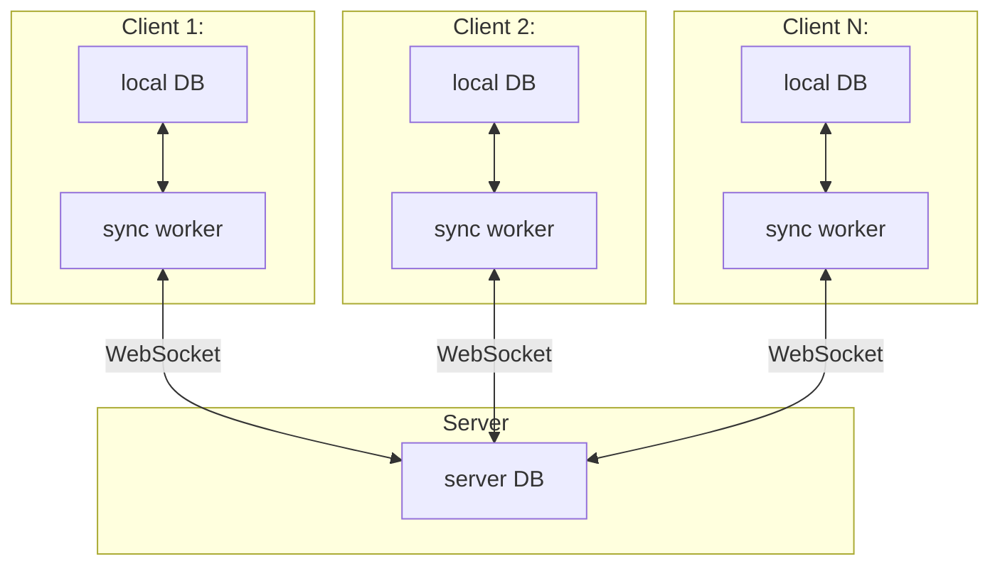
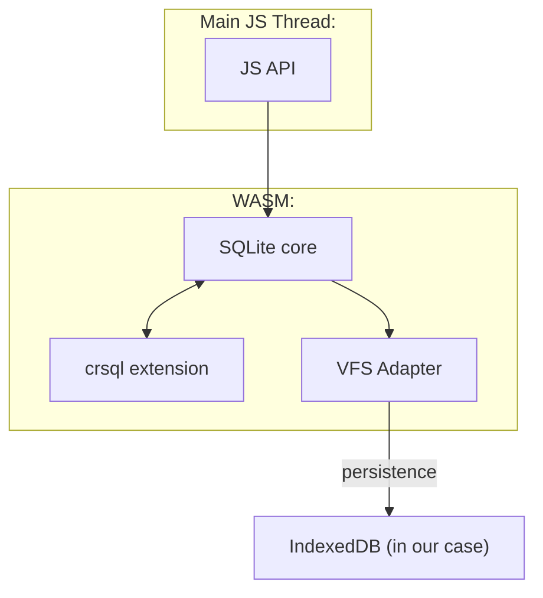
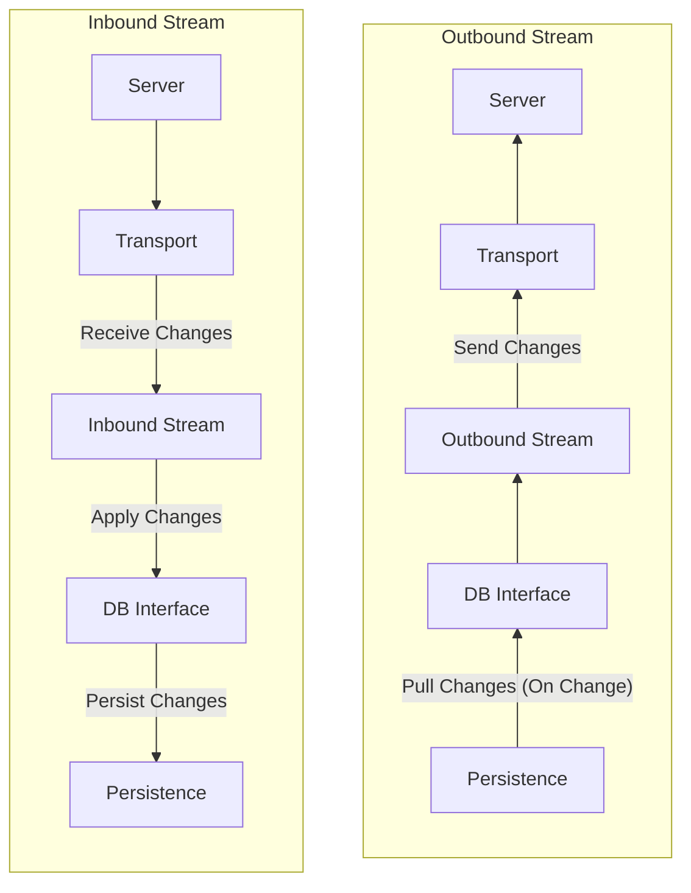
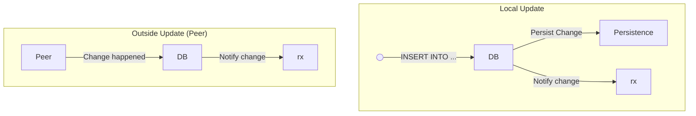
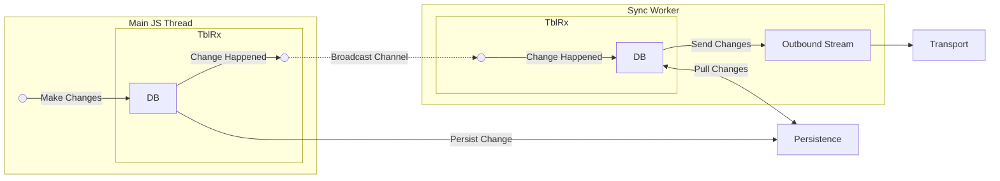
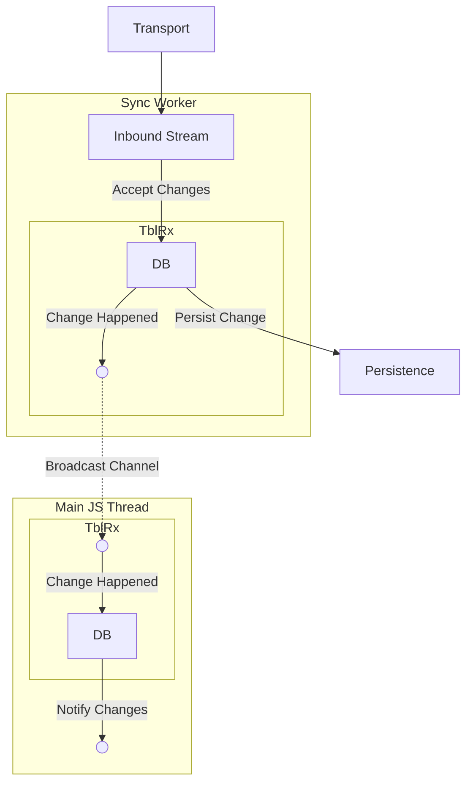
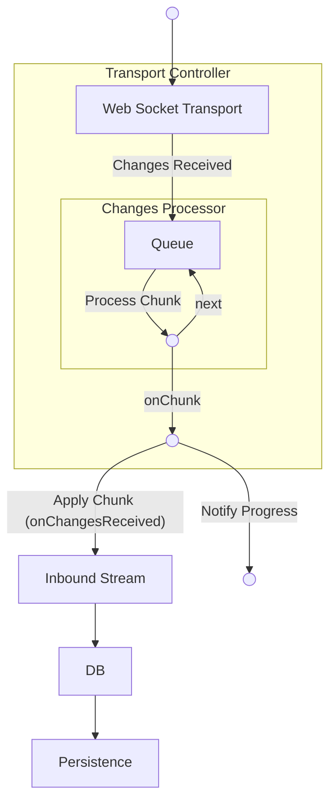
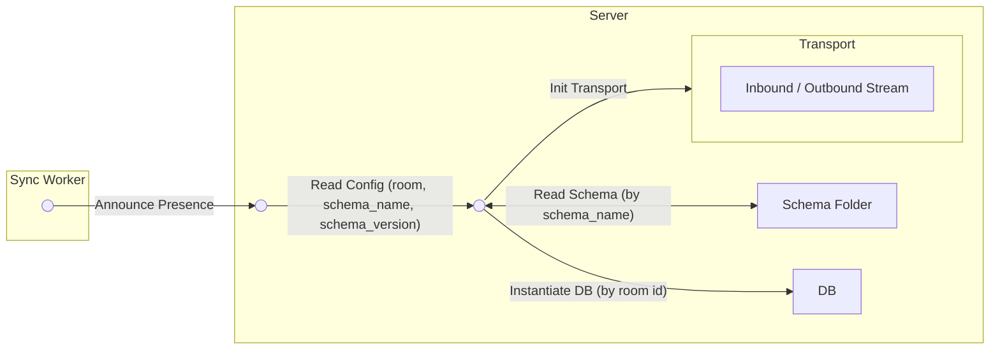
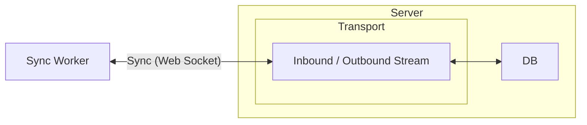
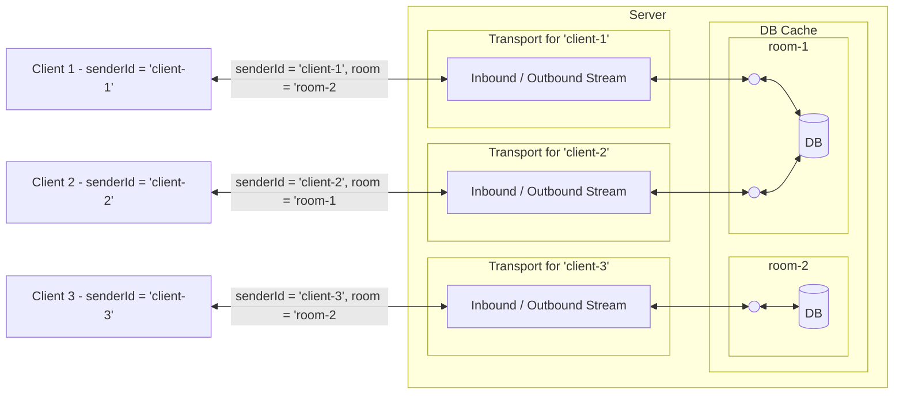

# DB stack

## Table of contents

1. [Overview](#overview)
2. [Local DB](#local-db)
3. [Sync worker](#sync-worker)
4. [Sync server](#sync-server)
5. [DB versioning and migrations](#db-versioning-and-migrations)

## Overview

Our DB is in-browser (local first), synced and replicated with the server. In order to achieve this we're using the technologies from [vlcn.io] stack.

The centerpiece of vlcn stack is cr-sqlite - an SQLite extension that seeks to make the DB sync friendly by using [CRDTs](https://vlcn.io/docs/cr-sqlite/crdts/about) to avoid conflicts.
While our DB stack is built on top of cr-sqlite, it is comprised of several components in order to achieve the functionality:

- **local DB** - local DB is a WASM build of SQLite (loaded with `crsql` extension) accessible from JS environment [see more](#local-db)
- **sync worker** - a glue between the client process and the server, the sync worker handles reactive syncing of local DB -> server and applies server -> local DB changes to the local DB in a reactive manner [see more](#sync-worker)
- **sync server** - a central hub for syncing all local nodes - the number of nodes is not limited, but all syncing in-between happens through the server [see more](#sync-server)

### The full (high level) architecture



## Local DB

The local DB is a WASM build of SQLite (including `crsql` extension) and is called directly from the main JS process. In order to handle client-side (app side) interactions with the DB, we're using the following stack

### [vlcn.io/crsqlite-wasm]:

This is a wrapper around [vlcn.io/wa-sqlite] (more below), providing some additional API for the JS-side DB initialisation.

It exposes two useful artifacts:

- `SQLite3` - a wrapper class performing additional (crsql-related) setup (on JS side) around the [vlcn.io/wa-sqlite] provided API

- `initWasm` - a one-shot initialisation for the entire API, e.g.:

  ```typescript
  import { initWasm } from "@vlcn-io/crsqlite-wasm";

  const sqlite = await initWasm();
  const db = await sqlite.open("db-name");

  await db.exec(/* ... */);
  ```

  Internally, it:
  - loads the WASM binary and the JS glue code (from [vlcn.io/wa-sqlite], more below)
  - registers the `IDBBatchAtomicVFS` (IndexedDB) as the default VFS adapter
  - wraps the code with aforementioned `SQLite3` wrapper

### [vlcn.io/wa-sqlite]

This is a JS / WASM library based on [rhashimoto/wa-sqlite] -- an unofficial WASM build of SQLite -- the difference between the two is that [vlcn.io/wa-sqlite] (the one we're using) wraps the build process so that the resulting `crsqlite.wasm` binary includes the `crsql` extension statically loaded.

It provides the foundation for the in-browser SQLite. It is comprised in a modular way, and, for our purposes, we can break it down into three relevant components: JS API, WASM binary and the VFS.



The JS API provides the glue code for WASM interaction: we create a JS object (using the provided factory), used to interact with the DB:

```ts
import { SQLite3 } from "vlcn.io/crsqlite-wasm";
import SQLiteAsyncESMFactory from "wa-sqlite/dist/wa-sqlite-async.mjs";

// Initialise the WASM moldule (glue code)
const sqlite3 = SQLite.Factory(wasmModule);

// Wrap (the JS side) to cr-sqlite
const api = new SQLite3(sqlite3);
```

The above is a simplified illustration of what `initWasm` (from [vlcn.io/crsqlite-wasm]) does under the hood.
Now, using the `initWasm` as a one-shot setup automatically registers `IDBBatchAtomicVFS`, using IndexedDB as the VFS adatper, but we can also register any other adapter satisfying the VFS interface.
I won't get into the interface itself, [see the examples for more](https://github.com/rhashimoto/wa-sqlite/tree/master/src/examples), but [rhashimoto/wa-sqlite] provides a few VFS adapters to chose from and we register them like so:

```ts
import { SQLite3 } from "vlcn.io/crsqlite-wasm";
import SQLiteAsyncESMFactory from "wa-sqlite/dist/wa-sqlite-async.mjs";
import { OPFSAnyContextVFS } from "wa-sqlite/src/examples/OPFSAnyContextVFS.js";

// Initialise the WASM moldule (glue code)
const sqlite3 = SQLite.Factory(wasmModule);

// Register the OPFS adapter
const vfs = await OPFSAnyContextVFS.create("opfs", wasmModule);
sqlite3.vfs_register(vfs, true);

// Wrap (the JS side) to cr-sqlite
const api = new SQLite3(sqlite3);
```

_Be advised: The example above should work as is, however we're experiencing some issues due to divergence between the two `wa-sqlite` repos so it might not work as-is out of the box._

## Sync worker

The sync worker is a dedicated worker used to communicate (and sync) the DB state between client and the server ([see the initial diagram](#the-full-high-level-architecture)).
We scaffold the worker using the code from [vlcn.io/ws-client] package, which provides a `start` function that sets up the worker and makes it available for syncing.

Furthermore, the default implementation (default config) uses:

- web socket transport (exported by [vlcn.io/ws-client]) - communicating to and from the server (in a way that's compatible with [vlcn.io/ws-server] setup, more below)
- browser db ([vlcn.io/ws-browserdb]) - a wrapper around [vlcn.io/crsqlite-wasm] and [vlcn.io/wa-sqlite] utilising [vlcn.io/rx-tbl] for reactivity (more below)

The "naked" worker exposes the following functionality:

- it listens to start / stop messages from the main thread to control the on/off lifecycle
- it accepts two components (in a modular way):
  - the DB instance (by way of DB provider, defaulting to a DB scaffolded by [ws-browserdb])
  - transport object (by way of transport provider)
- internally, it sets up inbound and outbound stream and communicates changes back and forth between the client and the server

Consider the following two diagrams:



Let's break this down:

- Inbound change:
  1. A change happens somewhere else (most often the server - either directly, or as a proxy for a change on another node)
  2. The change is communicated through the transport object (default: `WebSocketTransport`)
  3. The change is passed through the `InboundStream` - an internal of the sync process
  4. The change is communicated to the DB interface (JS object)
  5. The change is persisted (in respective VFS)

- Outbound change:
  1. A change happens in the local DB (this needs to be expanded, more below)
  2. The sync process listens to changes in a reactive manner (again more below)
  3. When the sync process is notified of changes, it pulls the changes from the DB (notified = knows something happened, not exactly what)
  4. The changes are communicated, via `OutboundStream` to the transport object
  5. The changes are sent (over transport) to the outside note (default: server)

Now, I've mentioned the local changes handling needs to be expanded as the flow is not a trivial one.
When a change happens within sync worker's DB interface (JS object), the sync process gets notifed.
However, that never happens in such manner: in practice, the change happens in the main JS thread and, without additional communication, the sync process never gets notified.
Therefore, we need additional "glue" to enable the sync worker to get notified of changes happening in the main JS thread.

On the other hand, the sync worker receives the changes from the server and persists them alright, but the main JS thread (while having access to the same VFS -- same data)
has no way of notifying the app of the changes having happened (e.g. the app needs to re-render with up-to-date data).

Enter [vlcn.io/rx-tbl]. Tblrx provides some magic allowing the main JS thread to notify the sync worker of changes and vice versa. Additionally, while doing so, it also exposes
the reactive API to it's own local process (this allows us to control the app's lifecycle so that the UI is updated when a change is applied to the DB locally), -- [see more below].

### TL;DR

Before getting down into the inner workings of the relevant stack, let us show the basic usage and not important things to consider:

Our initialisation (using the default setup) of the sync worker looks something like this:

```ts
// sync-worker.ts
import { type Config, defaultConfig } from "@vlcn.io/ws-client";
import { start } from "@vlcn.io/ws-client/worker.js";
// Interface to WASM sqlite
import { createDbProvider } from "@vlcn.io/ws-browserdb";
import wasmUrl from "@vlcn.io/crsqlite-wasm/crsqlite.wasm?url";

// Set up the config
const config: Config = {
  dbProvider: createDbProvider(wasmUrl), // Creates a reactive DB instance (see more below)
  transportProvider: defaultConfig.transportProvider
};

// Start the worker
start(config);
```

and in the main thread we do:

```ts
import { WorkerInterface } from "@vlcn.io/ws-client";
import SyncWorker from "./sync-worker.ts?worker"; // Using the same folder for simplicity

const worker = new WorkerInterface(new SyncWorker());
worker.startSync(dbid, { url, room: dbid });
```

Some quirks here:

- `dbid` - this is used to identify the **local DB** (`sqlite.open(dbid)`) and is not communicated with the server
- `url` is self explanatory - the URL of the WS server
- `room` - this value is communicated to the server and is used to **identify the DB on the server**, therefore we use the same value as DB name (for client/server consistency)

This initial setup is enhanced by the transport control (we use to control the sync), [see more below](#some-enhancements---how-we-control-the-sync).
Here we follow up by breaking down the packages used for client-worker sync communication.

### Inner workings

With the high-level overview, let's break down the components, and how they interact with each other, by breaking down the packages they come from.

#### [vlcn.io/ws-client]

WS-Client package exports the scaffolding for the worker:

- `start` function - used to start the whole process
- `defaultConfig` - the default worker config (including the, defatult, `WebSocket` transport)
- `WorkerInterface` - an interface used to communicate with the sync worker from the main thread

#### [vlcn.io/ws-browserdb]

Not much to say here except that it scaffolds a DB instnace as we'd use it in the browser context:

- [vlcn.io/crsqlite-wasm] JavaScript DB interface, built on top of [vlcn.io/wa-sqlite] WASM binary
- [vlcn.io/rx-tbl] - uses `tblrx` to provide for cross-process (main thead <-> sync worker) reactivity

#### [vlcn.io/rx-tbl] (reactivity)

This is where the majority of the magic happens. I'd mentioned above that the package provides a wrapper (`tblrx(db)`) to provide for reactivity.

This wrapping achieves the following flow:

0. The DB is wrapped (`const rx = tblrx(db)`):

- the `TblRx` (internal) subscribes to changes (`db.onChange`)
- the `TblRx` instance is returned, exposing reactive API

1. When the change happens, both the local subscribers (consumers of the `rx` object) and peers get notified
2. By extension of point 1., when an update happens on a peer, our DB is notified as well

```ts
// example with two peers (in the same thread)

// An abstract function that constructs a pristine DB instnace for purpose of this exmple
import { getDB } from "./db";
import rxtbl from "@vlcn.io/rx-tbl";

// Create two (unrelated peers)
const db1 = getDB("dev");
const db2 = getDB("dev");

const rx1 = tblrx(db1);
const rx2 = tblrx(db2);

// Subscribe to changes
rx1.onAny(() => console.log("change registered at db1!"));
rx2.onAny(() => console.log("change registered at db2!"));

// Write to DB 1
await db1.exec("INSERT INTO customer (id, name) VALUES (1, 'Alice')");

// Console prints:
// change registered at db1! -- direct reactivity
// change registered at db2! -- reactiviry via peer notification
```

Even though we've used same process to define our 2 DBs for this example, the same works between the main thread and the sync worker:

```ts
// example with two peers: 1 in the worker, 1 in the main thread

// main thread
const db = getDB("dev");
const rx = tblrx(db1);
rx.onAny(() => console.log("change registered at main thread"));

// sync-worker.ts
const db = getDB("dev");
const rx = tblrx(db);

rx.onAny(() => console.log("change registered in the sync worker"));
// Write to the DB (in the worker)
await db.exec("INSERT INTO customer (id, name) VALUES (1, 'Alice')");

// Console prints:
// change registered in the sync worker -- immediate reactivity
// change registered at main thread -- reactivity from (worker's) peer norification
```

To achieve this behaviour, the `TblRx` instance uses a named `BroadcastChannel` - (part of a standard Web API for cross-process communication).
The `BroadcastChannel` is named the same way as the DB name (`"dev"` in this case) - this way, when both the DB in the Main thread and DB within the worker, they subscribe to the
broadcast channel for that particular DB: allowing for observing of changes to the particular DB, but without the risk of interference (in case we're using a different DB -- differently named, different persistance).

To visualise, the `tblrx` wrapping achieves two kinds of reactiviy for the DB:



Finally, our updated model of Inbound/Outbound sync messages looks like this:

Outbound message (relaying local change)



Inbound message (accepting remote change)



Finally, the `TblRx` allows for more fine-grained control over the changes subscription:

```ts
rx.onAny(() => {...}) // Notify on any change
rx.onRange(["customers", "notes"], () => {...}) // Notify on any change to "customers" or "notes" tables
rx.onPoint("customers", 1 , () => {...}) // Notify only on change to entry in "customers" table with rowid of 1
```

### Some enhancements - How we control the sync

Using the default sync setup works out of the box. However, there were some issues with it:

1. initial sync of the DB (50k entries) was quite slow
2. interupting sync (by unloading the page -- refreshing or navigating away) would result in corrupted DB state.

In order to remedy the latter, we wanted to (1) be able to tell when the sync starts/stops (in order to block unloading during that time) and (2) ideally, be able to tell the progress (applied changes / total changes) for better UX.
As for the former, we wanted to have some control of the way the chunks were being applied.

Now, we can't control the sync process itself (not without forking [vlcn.io/ws-client] at least), but we can control the transport (by specifying our own `Transport` interface).

The transport interface was fine as it is, we just wanted to tap into the inbound changes received, so we wrapped the original `WebSocketTransport`:

Somewhere within the stack of sync worker abstractions ([here](https://github.com/vlcn-io/js/blob/main/packages/ws-client/src/SyncedDB.ts#L25)),
the sync worker overrides the transport's `.onChangesReceived` method and attaches it to the `InboundStream`:

```ts
class SyncedDB {
  readonly #transport;
  readonly #inboundStream;

  // ...

  constructor() {
    // ...

    this.#transport.onChangesReceived = this.#inboundStream.receiveChanges;
  }

  // ...
}
```

The transport interface does, in fact provide a set of immutable methods and three mutable methods `.onStartStreaming`, `onChangesReceived`, `onResetStream`.
In order to wrap the transport and have more control over the transmission we do something like this:

```ts
class TransportController {
  readonly #transport;

  // Immutable methods - these are passed on as they are
  announcePresence: Transport["announcePresence"];
  // ...rest immutable methods

  // Mutable methods - we expose these for downstream overrides,
  // while keeping control over the same methods of the internal transport
  onChangesReceived: Transport["onChangesReceived"] = null;
  // ...rest mutable methods

  constructor(transport: Transport) {
    this.#transport = transport;

    // ... Bind all transport immutable methods to TransportController's methods, e.g.
    this.announcePresence = this.#transport.announcePresence.bind(this.#transport);

    // Hijack the mutable methods (e.g. onChangesReceived)
    this.#transport.onChangesReceived = this._onChangesReceived;
  }

  // We're "routing" internal transport's onChangesReceived here (this is immutable and will always run - won't be overriden downstream)
  private async _onChangesReceived(msg: Parameters<Transport["onChangesReceived"]>[0]) {
    // Call the exposed '.onChangesReceived' (overridden downstream, see previous code block ^^)
    await (this.onChangesReceived?.(msg) || Promise.resolve());
  }
}
```

Now that we have control over the transmission (especially the application of received changes), we can utilise it to signal sync in-progress.
We define some "event emitter" (not event emitter in strictest JS sense, but an object allowing for listening of sync start / stop events):

```ts
interface SyncEventEmitter {
  notifySyncStarted(); // Used to signal the sync start (by transport controller)
  notifySyncDone(); // Used to signal the sync done (by transport controller)

  onSyncStarted(notify: () => void): () => void; // Used to subscribe to sync start events (returns disposer)
  onSyncDone(notify: () => void): () => void; // Used to subscribe to sync done events (returns disposer)
}
```

We pass the event emitter to transport controller like so:

```ts
class TransportController {
  // ...

  onChangesReceived: Transport["onChangesReceived"] = null;

  constructor(transport: Transport, progressEmitter: SyncEventEmitter) {
    // ...

    // Hijack the mutable methods (e.g. onChangesReceived)
    this.#transport.onChangesReceived = this._onChangesReceived;
  }

  private async _onChangesReceived(msg: Parameters<Transport["onChangesReceived"]>[0]) {
    this.#progressEmitter.notifySyncStarted();

    // Since '.onChangesReceived' is hooked up to 'InboundStream' (applying those changes),
    // awaiting the function let's us know when the changes have been applied (sync done)
    await (this.onChangesReceived?.(msg) || Promise.resolve());

    this.#progressEmitter.notifySyncDone();
  }
}
```

Next, we've updated the sync worker to:

- wrap the transport (into `TransportController`) before passing it to the sync process (as `config`)
- subscribe to sync start / stop events (using the `SyncEventEmitter` interface) and notify the main thread of the same

Finally, we've updated the `WorkerInterface` (used in the main thread) to expose the same events in the main thread (for UI updates)

Next, the payload send in `.onChangesReceived` (`msg`) contains the full set of changes (the entire DB state during initial sync). With the default implementation, this would applied in bulk (single looong operation).
We've split this up into chunks, at transport level and are sending those chunks (instead of one large blob) to the downstream `.onChangesReceived`:

```ts
// Updated to not signal start / stop, but rather
// signal the progress
interface SyncEventEmitter {
  notifyProgress(progres);
  onProgress(notify: (progress) => void): () => void;
}

type ChunkTask = {
  chunk: Changes;
  nProcessed: number;
  nTotal: number;
};

class ChangesProcessor {
  // ...

  // Overridable (mutable methods)
  //
  // Overriden downstream to attach to a function handling application of a single chunk
  onChunk: (task: ChunkTask) => Promise<void> | null = null;
  // Overriden downstream to attach to done notifier
  onDone: () => void | null = null;

  enqueue(msg: Changes) {
    // Split the changes into chunks (default size 1024, but configurable)

    // Start processing
    // NOTE: the actual implementation differs, this is a simplified version for purpose
    // of the example
    for (const chunk of chunks) {
      await this.onChunk?.({ chunk, nProcessed, nTotal });
      // Update the counter
    }
  }
}

class TransportController {
  // ...
  #changesProcessor = new ChangesProcessor();

  onChangesReceived: Transport["onChangesReceived"] = null;

  constructor(transport: Transport, progressEmitter: SyncEventEmitter) {
    // ...

    // Hijack the mutable methods (e.g. onChangesReceived)
    this.#transport.onChangesReceived = this._onChangesReceived;

    // Route the chunk queue processor's 'onChunk' to local '_onChunk'
    this.#changesProcessor.onChunk = this._onChunk.bind(this);
  }

  private async _onChangesReceived(msg: Parameters<Transport["onChangesReceived"]>[0]) {
    // Instead of passing to downstream '.onChangesReceived', enqueue the chunk
    this.#changesProcessor.enqueue(msg);
  }

  private async _onChunk(task: ChunkTask) {
    // Notify of the progress
    this.#progressEmitter.notifyProgress(/* progress inered from the chunk 'task' */);

    // Pass the chunk to the downstream 'onChangesReceived' -- sync process applying the change
    // Notice how this is the same as the previous implementation, only difference being in the applicatin of
    // chunks rather than the entire blob
    await this.onChangesReceived?.(task.chunk);
  }
}
```

_Note: The implementation above is greatly simplified (for example purposes) and the actual implementaion is sightly different, [see source for more]()_

To visualise the updated transport (sync) flow:



This flow achieves all of the sync reporting goals:

- it allows us to show sync `active` state in the UI
- it provides for better UX - showing of progress bar

Finally, even though this provides for more control over chunk processing, **we didn't have to massage the chunk application process whatsoever**,
rather, the mere chopping up of changes into chunks and applying like so resulted in a **speed up of an order of magniture (and slightly more)** compared to (default) monolithic chunk application.

## Sync server

Sync server is scaffolded using exports from [vlcn.io/ws-server] package, namely `attachWebSocketServer` (using Express server app):

```ts
import * as http from "http";
import { attachWebsocketServer } from "@vlcn.io/ws-server";
import express from "express";

import { getInitializedDB } from "./db";

const PORT = process.env.PORT || 3000;
const app = express();
const server = http.createServer(app);

const wsConfig = {
  dbFolder: "./test-dbs", // Instructs the server as to where to store DB files
  schemaFolder: "./src/lib/schemas", // Instructs the server as to where to look for the schema (more belo)
  pathPattern: /\/sync/ // Sync endpoints are matched by this pattern (and all requests upgraded to WebSocket)
};

// This is where the magic happens
attachWebsocketServer(server, wsConfig);
```

_Note: while we do feature a CRUD, it is a bit of a legacy code, was used for initial DEV and is, in practice not in use anymore._

Let's examine the sync server by looking at the package that scaffolds it.

### [vlcn.io/ws-server]

The package exports the aforementioned `attachWebsocketServer` function, which accepts:

- `server` instance
- `config` object
- `dbFactory` (optional) - custom factory used to retrieve (construct) the DB instance for a particular `room` (more below) - _we're using default at this time_
- `customFsNotify` (optional) - custom file system notification handler (default is `null`) - _we're using default at this time_
- `authenticate` (optional) - a custom auth flow, if we were to implement one - _we're using default at this time_

The `config` object (already shown) looks like this

```ts
const wsConfig = {
  dbFolder: "./test-dbs", // Instructs the server as to where to store DB files
  schemaFolder: "./src/lib/schemas", // Instructs the server as to where to look for the schema (more belo)
  pathPattern: /\/sync/ // Sync endpoints are matched by this pattern (and all requests upgraded to WebSocket)
};
```

`dbFolder` is self explanatory - where the DB files will (or do) live, so is the `/\/sync/` regex pattern - all requests against endpoints matched by this pattern will be upgraded to WebSocket and handled by the sync server.

`schemaFolder` is a folder where the server will look for a particular schema. The schema is relayed in the initial request (`announcePresence`, more below).

### [vlcn.io/ws-common]

One relevant export for our purposes - `cryb64(schemaContent: string): number` - a function used to calculate `schema_version` (a hash of the schema file, more below)

### Interacting with the sync server

#### TD;DR

The important thing to note when interacting with the server is that the [sync worker](#sync-worker) is the one that handles the communication with the server, using WebSocket transport, in such a way that's compatible with the server.
The important input on our part consists of the following:

- DB should contain two entries in the `crsql_master` table (these are read and communicated with the server by sync worker):
  - `key = 'schema_name'`, `value =` - the name of the DB schema - this is used by the server to look into the `schemaFolder` (see config above) and load the schema file by the value provided here, **important** - the schema name can't have any special characters (this includes `.`, so no `.sql`, or `.sqlite3` extensions, e.g. we're using `init`, not `init.sql`).
  - `key = 'schema_version'`, `value =` - a hash of the schema file, there's a special function that computes the hash (`cryb64`, exported from [vlcn.io/ws-common]) - when a schema is loaded on the server, the server hashes it and checks if the communicated schema version matches the server-side one
- we need to pass the correct params when starting the sync:

```ts
worker.startSync({
  // This value is kept at the worker level (as mentioned above) - it's used to perform sqlite3.open(dbid)
  // This is our local DB, that the worker uses to sync to/from, as well as reading the aforementioned `schema_name` and `schema_version`
  // (communicated at initial connection)
  dbid: "dev",
  // Sync server URL (not important)
  url: "ws://localhost:3000/sync", // URL of the sync server
  room: "dev" // Room name - used to identify the DB on the server
});
```

To break this down:

- `dbid`:
  - this is used to access the DB locally (e.g. `sqlite.open(dbid)`)
  - this isn't communicated to the server
- `url`: self explanatory
- `room`:
  - this is a bit of a tricky one
  - it is used to identify the DB on the server, i.e.

  ```ts
  // The server does something like this
  import Database from "better-sqlite3";
  const dbPath = [config.dbFolder, room].join("/");
  const db = new Datebase(dbPath);
  ```

  - it doesn't have to match any dbid (dbname), but if we want to sync two (or more) clients, they have to use the same `room`
  - for our purposes it makes the most sense to use `dbid` (db name) for both the local DB file as well as the on-server DB (baked into the code), making sure all the client nodes always use the same "master" DB (server room)

#### Inner workings (single client setup)

Sync flow (from server's perspecive):

1. The WebSocket connection is established (upgraded and all)
2. The Sync Worker sends and `AnnouncePresence`



_note: the diagram above shows (simplified) single client flow_

3. As the connection is established (and presence announced), the sync flows over IO streams to and from the DB



#### Inner workings (multi client setup - intricacies of 'room' and 'senderId')

_note: I'm laying this out for better understanding of server and relevant config variables: what is the purpose of each and how they're used. It's important to note that, in production, we're using the same `room`, while the `senderId` is auto-generated._

In multi client setup, the server needs to:

- identify different clients
- group clients together so that (1) all clients with a group sync up (2) different groups don't interfere with each other

This is done by way of `room` and `senderId`.

The `room` was mentioned a couple of times above and I hope this makes it clear, to recap:

- `room` is communicated at the start of the sync connection (by way of `announcePresence`, handled by sync worker)
- it serves as an identifier for a group of client nodes that should be synced
- it can take any value, but the value should be consistent across clients we want syncing up
- if we look at the implementation level: it is used to instantiate/access the "master" DB on the server (as a DB name)
- for convenience, we're using the same name as the (local) DB name, e.g. `"dev"` in development

Now, the `senderId` is communicated by the sync worker (by way of `announcePresence` message) as well and is hidden away from the client code:

- it's unique to the particular node (I don't know how it's achieved, but I imagine some random generator)
- under the hood the `db.siteid` (I have no clue what that is) is used
- on the server it is used to id different client nodes

The multi-client (multi-room for sake of clarity) diagram looks like this:



Here the `client-1` and `client-2` are using the same room (`room-1`) and are thus:

- accessing the same DB
- kept in sync (between themselves)

The `client-3` uses `room-2`, which is completely separated from `room-1` and its state doesn't affect the state of `room-1` nor its clients (and vice versa).

## DB versioning and migrations

### Overview

As mentioned above, an important part of DB setup are the `schema_name` and `schema_version` entries in the `crsql_master` table. Here we dig a bit deeper into how those are set, how the DB is versioned and how we perform the migrations.

The DB is versioned by hashing the schema file, e.g.

The schema file looks something like this

```sql
/* init.sql */

CREATE TABLE IF NOT EXISTS customer (
    id INTEGER NOT NULL,
    name TEXT,
    PRIMARY KEY (id)
)
```

We load the schema and version it using the `cryb64` function (exported from [vlcn.io/ws-common]), and load the schema:

```ts
import { cryb64 } from "@vlcn.io/ws-common";
import schemaContent from "./init.sql?raw"; // Load the schema file as a string

const schemaName = "init";
const schemaVersion = cryb64(schemaContent); // Hash the schema content

const db = await getDB("dev"); // Not getting into internals of initialising the DB, see the first sections of this document

// Initialise the DB
await db.exec(schemaContent);

// Store schema name and version
await db.exec(`INSERT INTO crsql_master (key, value) VALUES ('schema_name', ?)`, [schemaName]);
await db.exec(`INSERT INTO crsql_master (key, value) VALUES ('schema_version', ?)`, [schemaVersion]);
```

Now, if we were to update the schema in the slightest (even adding a comment), e.g.

```sql
/* init.sql */

-- This comment tells us something very important about the table
CREATE TABLE IF NOT EXISTS customer (
    id INTEGER NOT NULL,
    name TEXT,
    PRIMARY KEY (id)
)
```

this will produce a completely different version (which makes sense: the string representation of the schema is different, therefore the hash is different).

Now, when loading the DB, we need to check:

- whether or not the DB is initialised
- whether or not the schema name and version match the expected ones

The updated init flow:

```ts
import { cryb64 } from "@vlcn.io/ws-common";
import schemaContent from "./init.sql?raw"; // Load the schema file as a string

const schemaName = "init";
const schemaVersion = cryb64(schemaContent); // Hash the schema content

const db = await getDB("dev"); // Not getting into internals of initialising the DB, see the first sections of this document

// Check if the DB is initialised
const [_schemaName, _schemaVersion] = await getSchemaAndVersion(db); // Something like SELECT key, value FROM crsql_master WHERE key IN ('schema_name', 'schema_version')

if (!_schemaName || !_schemaVersion) {
  // NOTE: Not handling partial init (e.g. name exists, but not the version -- keeping it simple)

  // Initialise the DB
  await db.exec(schemaContent);

  // Store schema name and version
  await db.exec(`INSERT INTO crsql_master (key, value) VALUES ('schema_name', ?)`, [schemaName]);
  await db.exec(`INSERT INTO crsql_master (key, value) VALUES ('schema_version', ?)`, [schemaVersion]);
} else {
  // Check name / version match
  if (schemaName !== _schemaName) {
    // This should never happen -- handle the error elsewhere
    throw new Error("Schema name mismatch: you probably want to nuke the DB and reinitialise clean");
  } else if (schemaVersion !== _schemaVersion) {
    // This is quite common -- as mentioned above, the version changes with any slight update to the schema
    // However -- handle elsewhere
    throw new Error("Schema version mismatch: you might want to migrate the DB to the up-to-date version");
  }
}
```

In this example, we're throwing an error when a mismatch is encountered:

- we consider the DB unusable if the schema stored is different than the one we expect
- we throw an error, letting the updates/reinitialisations/migrations be handled elsewhere

### Migrations

#### TL;DR

The crsql extension ships with an automigration functionality, execution of which is as simple as running:

```ts
import schemaContent from "./init.sql?raw"; // Load the schema file as a string

const schemaName = "init";

await db.automigrateTo(schemaName, schemaContent);
```

The `db.automigrateTo` method will:

- check the diff
- update the DB's schema
- hash the content and update the `schema_version`
- additional note: even if `schema_name` mismatches the `schemaName` provided, the automigration will handle that case

**IMPORTANT NOTE:** autmigration re-applies the schema, so we need to make sure the schema is idempotent (e.g. `CREATE TABLE IF NOT EXISTS ...` instead of mere `CRATE TABLE ...`), otherwise the migration will fail.

#### Inner workings

This section describes the automigration innter workins in more detail, which, while not strictly necessary, can come useful if we need to debug / reason about the way we perform DB versioning/migrations.

The flow (running `db.automigrateTo(schemaName, schemaVersion)`) looks something like this:

1. Check if the `schemaName` (provided) matches the `schema_name` (stored in the DB):
   - if not, the DB is nuked and reinitialised (the flow is done here)
   - if match, continue
2. Check if the `schemaVersion` (provided) matches the `schema_version` (stored in the DB):
   - if match, the flow is done here
   - if not, preform automigration
3. Run `crsql_automigrate` and internal (SQL) function, loaded within the SQLite process by the `crsql` extension\* (the following steps happen within the SQLite process)
4. Create a new (transient) in-memory DB and apply schema to it
5. Check table differences between the two DBs (the original one and the one with the new schema applied):
   - check if some tables should be removed
   - check if some tables should be updated (columns added/removed/updated)
   - don't add new tables just yet
   - check if indices should be removed/updated
   - don't add new indices just yet
6. Apply the changes: removals and updates
7. Apply the new schema to the original DB: **this is why we need to make sure the schema is idempotent** (e.g. `CREATE TABLE IF NOT EXISTS ...`), otherwise the migration will fail
8. Finally: store the new version to the DB

_\* the function is implemented in Rust as part of the extension implementation, you can [see the implementation here](https://github.com/vlcn-io/cr-sqlite/blob/main/core/rs/core/src/automigrate.rs). If you prefer to read JavaScript to Rust, we've ported the implementation to JavaScript (for debug purposes), [which can be found here](https://github.com/librocco/librocco/blob/main/apps/web-client/src/lib/db/cr-sqlite/debug/migrations.ts)_

#### How we use the schema / migrations

We use the same schema for the server DB and the client DB as a single source of truth:

- one intricacy is: we can't use the `.sql` extension due to constraints imposed by the sync server (see more above), so our schema (file) name is simply `init`
- we use `"init"` as our `"schema_name"` for simplicity
- **we make sure the schema is idempotent**: instead of using `CREATE TABLE` / `CREATE INDEX`, we do `CREATE TABLE IF NOT EXISTS` (and respective index check)

Similarly to the initialisation flow detailed above:

- we throw errors if schema name/version mismatch the existing ones.
- the (respective) error is handled by presenting user with a prompt to automigrate the DB.
- on confirmation, we run the automigration

**Some things to we've yet to figure out**

What happens when server / client schema mismatch?

What happens when server schema doesn't match the one committed in git?

[vlcn.io]: https://vlcn.io
[vlcn.io/crsqlite-wasm]: https://github.com/vlcn-io/js/tree/main/packages/crsqlite-wasm
[vlcn.io/wa-sqlite]: https://github.com/vlcn-io/wa-sqlite
[vlcn.io/ws-common]: https://github.com/vlcn-io/js/tree/main/packages/ws-common
[vlcn.io/ws-client]: https://github.com/vlcn-io/js/tree/main/packages/ws-client
[vlcn.io/ws-browserdb]: https://github.com/vlcn-io/js/tree/main/packages/ws-browserdb
[vlcn.io/ws-server]: https://github.com/vlcn-io/js/tree/main/packages/ws-server
[vlcn.io/rx-tbl]: https://github.com/vlcn-io/js/tree/main/packages/rx-tbl
[rhashimoto/wa-sqlite]: https://github.com/rhashimoto/wa-sqlite/
